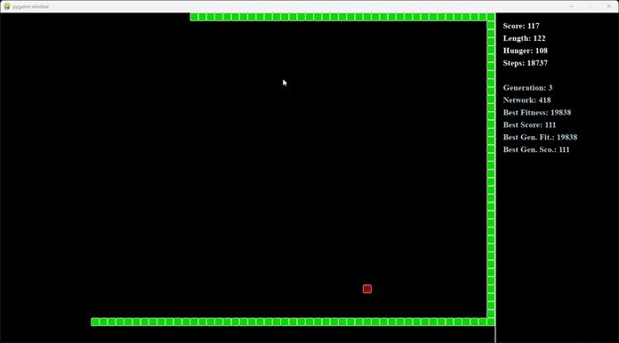

# 🐍 Snake AI com Algoritmo Genético

Projeto de Inteligência Artificial utilizando **Redes Neurais** e **Algoritmo Genético** para treinar uma cobra a jogar Snake automaticamente.

A IA aprende através de evolução genética, sem datasets ou treinamento supervisionado. Cada geração melhora com base no desempenho das melhores redes neurais.

---



---

## 🚀 Tecnologias Utilizadas

- Python 3
- Pygame
- Redes Neurais do zero
- Algoritmo Genético
- Pickle (persistência da população)

---

## 🧠 Como Funciona

A IA controla a cobra utilizando uma rede neural simples.

### Entradas da rede (10 inputs)

A rede recebe informações do ambiente:

- Perigo na frente
- Perigo à esquerda
- Perigo à direita
- Comida na frente
- Comida à esquerda
- Comida à direita
- Direção atual da cobra:
  - esquerda
  - direita
  - cima
  - baixo

### Saídas da rede (3 outputs)

A rede decide entre:

- Virar à esquerda
- Continuar reto
- Virar à direita

---

## 🧬 Algoritmo Genético

A evolução acontece da seguinte forma:

1. Uma população de redes neurais é criada
2. Cada rede joga uma partida
3. As melhores redes são selecionadas
4. Cópias sofrem mutações aleatórias
5. Uma nova geração é criada
6. O processo se repete indefinidamente

---

## 📊 Função de Fitness

A pontuação da IA é baseada em:

```python
fitness = (score * 100 + steps * 0.5 - hunger * 2)
```

A IA é recompensada por:

- Comer comida
- Sobreviver mais tempo

E penalizada por:

- Ficar muito tempo sem comer

---

## 📁 Estrutura do Projeto

```bash
project/
│
├── neural_network
    └── genetic.py          # Algoritmo Genético principal
    └── network.py          # Estrutura da rede neural
    └── neuron.py           # Implementação do neurônio
│
├── game/
    └── snake.py            # Lógica do jogo
    └── player.py           # Player object
    └── block.py            # Block object
    └── food.py             # Food object
│   
├── requirements.txt        # Dependências
├── README.md               # README file
```

---

## ⚙️ Estrutura da Rede

Estrutura utilizada atualmente:

```python
[10, 16, 3]
```

- 10 neurônios de entrada
- 16 neurônios ocultos
- 3 neurônios de saída

---

## 💾 Salvamento Automático

A população é salva automaticamente utilizando `pickle`.

Arquivos gerados:

- `neural_network.pkl`
- `structure.pkl`

Ao iniciar novamente, o treinamento continua da última geração salva.

---

## ▶️ Como Executar

### 1. Clone o repositório

```bash
git clone https://github.com/seu-usuario/seu-repositorio.git
```

### 2. Entre na pasta

```bash
cd seu-repositorio
```

### 3. Instale as dependências

```bash
pip install -r requirements.txt
```

### 4. Execute o projeto

```bash
python genetic.py
```

---

## 📈 Métricas Exibidas

Durante o treinamento:

- Geração atual
- Rede atual
- Melhor fitness geral
- Melhor score geral
- Melhor fitness da geração
- Melhor score da geração

---

## 🔥 Possíveis Melhorias Futuras

- Cross-over entre redes
- Mutação adaptativa
- Mais sensores de visão
- Redes neurais profundas
- Paralelização da população
- Replay das melhores partidas
- Treinamento acelerado sem renderização
- Exportação de métricas
- Visualização gráfica da evolução

---

## 📚 Conceitos Aplicados

Este projeto utiliza conceitos de:

- Inteligência Artificial
- Machine Learning
- Neuroevolução
- Algoritmos Genéticos
- Redes Neurais
- Programação orientada a objetos

---

## 🧪 Exemplo de Funcionamento

A cada geração:

- As melhores cobras sobrevivem
- Redes ruins são descartadas
- Novas redes surgem através de mutações
- O comportamento melhora gradualmente

Com o tempo, a IA aprende:

- Evitar paredes
- Evitar o próprio corpo
- Encontrar comida
- Sobreviver por mais tempo

---

## 👨‍💻 Autor

Desenvolvido por Vinicius Lemes.
